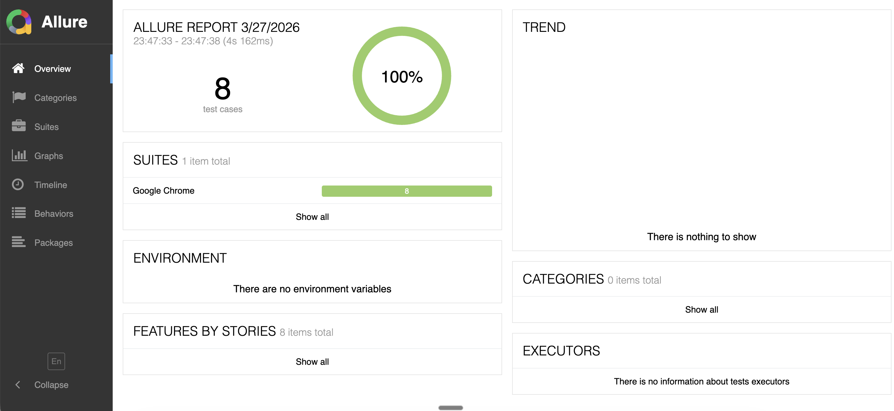
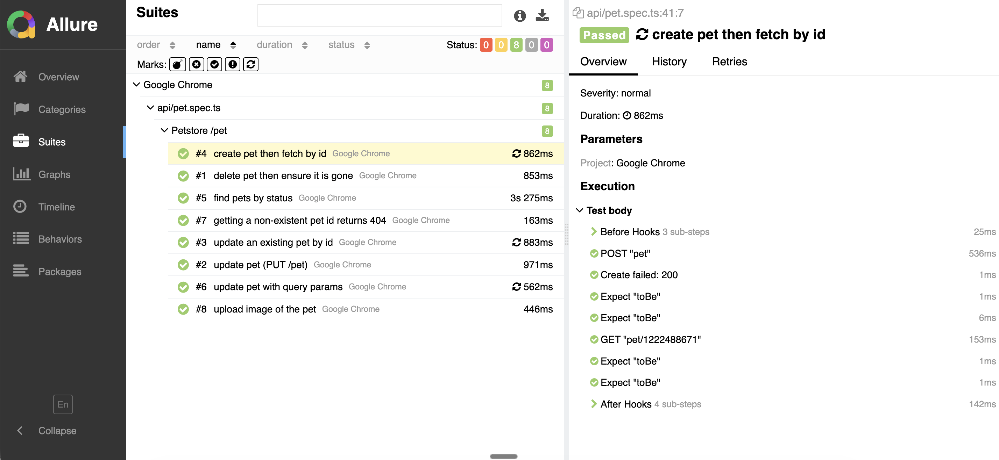
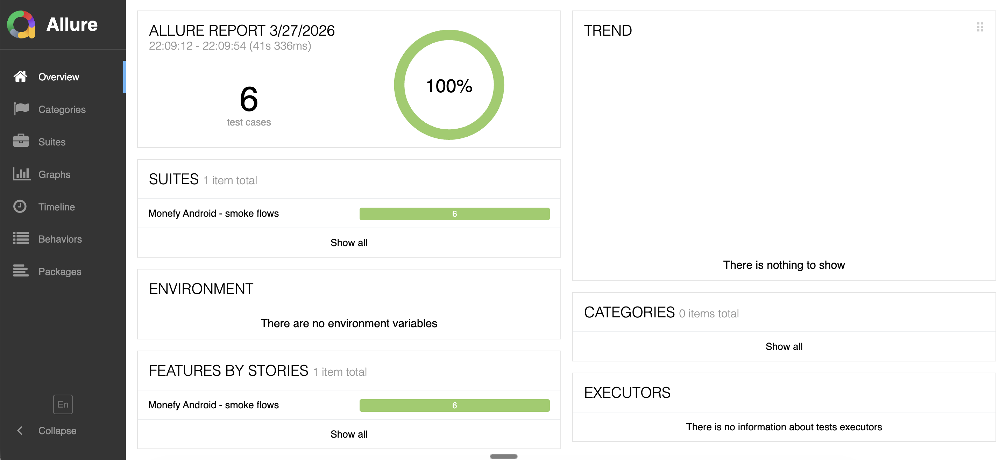
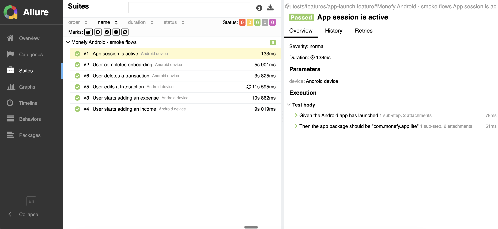

# aditi-sukalikar-N26-Assignment

This repository groups **quality assurance work**: exploratory testing charters, automated API tests, automated Android UI tests, and **Allure** HTML reports. Each major area lives in its own top-level folder so you can clone once and work in the slice you need.

---

## Repository layout


| Folder                                         | Purpose                                                                                                                  |
| ---------------------------------------------- | ------------------------------------------------------------------------------------------------------------------------ |
| `[exploratory-testing/](exploratory-testing/)` | **Manual exploratory testing** deliverables (e.g. session reports) in Markdown.                                          |
| `[api-automation/](api-automation/)`           | **REST API automation** with Playwright against the public Swagger Petstore. TypeScript specs, helpers, and CI workflow. |
| `[mobile-automation/](mobile-automation/)`     | **Android UI automation** for the Monefy app: WebdriverIO, Appium, Cucumber (Gherkin), Allure.                           |
| `[screenshots/](screenshots/)`                 | Reference images for **Allure HTML reports** (API and mobile automation), linked from this README.                     |
|                                                |                                                                                                                          |


Root files:

- `**.gitignore`** — Ignores dependencies, env files, logs, build artifacts, and Allure output patterns (including `allure-report-combined`).

---

## Prerequisites (overview)

What you need depends on which folder you use:


| Area                    | Typical requirements                                                                                                                                                           |
| ----------------------- | ------------------------------------------------------------------------------------------------------------------------------------------------------------------------------ |
| **exploratory-testing** | None beyond a text editor or Markdown viewer.                                                                                                                                  |
| **api-automation**      | [Node.js](https://nodejs.org/) (LTS recommended), npm. Playwright may prompt for browser install for parity with CI.                                                           |
| **mobile-automation**   | Node.js, npm, [Android SDK](https://developer.android.com/studio) (`ANDROID_HOME`), emulator or physical device, Appium-related tooling as described in that project’s README. |
| **Allure reports**      | [Allure Commandline](https://docs.qameta.io/allure/) is pulled in via npm in the automation projects; opening HTML reports only needs a browser.                               |


---

## Quick start by folder

### Exploratory testing (`exploratory-testing/`)

Contains **written exploratory testing outputs**, for example structured session reports (charters, findings). Start with the Markdown file(s) in that directory—currently `report.md` documents an exploratory session on the Monefy Android app.

---

### API automation (`api-automation/`)

Playwright-based API tests (Swagger Petstore). Configuration, scripts, and folder map:

- `**tests/api/constants/`** — Paths and shared values.
- `**tests/api/types/`** — Request/response TypeScript shapes.
- `**tests/api/helpers/`** — HTTP helpers, payload builders, pet API helpers.
- `**tests/api/pet.spec.ts**` — Main Pet API scenarios.
- `**playwright.config.ts**` — Base URL and test options (including optional dotenv for env-based URLs).
- `**.github/workflows/playwright.yml**` — CI run for the API suite.

From the repo root:

```bash
cd api-automation
npm install
npx playwright install --with-deps
npm run test:api
```

Full commands (reports, Allure, filtering tests) are documented in **[api-automation/README.md](api-automation/README.md)**.

#### Allure report (API automation)

Sample views from the generated HTML report:





---

### Mobile automation (`mobile-automation/`)

End-to-end Android tests for **Monefy** using WebdriverIO, Appium, and Cucumber.

- `**tests/features/`** — `.feature` Gherkin scenarios.
- `**tests/steps/`** — Step definitions.
- `**tests/pages/`** — Page objects and selectors.
- `**tests/support/**` — Hooks, capabilities, failure screenshots for Allure.
- `**wdio.conf.ts**` — Runner, Cucumber, reporters, Appium service.
- `**.env**` — Create locally (gitignored): device, app package/activity, optional `ANDROID_UDID`, etc.

Typical flow: configure `.env`, start an emulator or connect a device, then run WebdriverIO from `mobile-automation/`.

```bash
cd mobile-automation
npm install
npm run wdio
```

Detailed prerequisites (`ANDROID_HOME`, AVD, Appium port **4723**), scripts, and reporting are in **[mobile-automation/README.md](mobile-automation/README.md)**.

#### Allure report (mobile automation)

Sample views from the generated HTML report:





---

## Contributing / conventions

- **Install and run commands from inside** `api-automation/` or `mobile-automation/`—each has its own `package.json`.
- **Do not commit secrets:** use `.env` (ignored) for local device and app settings in mobile automation.
- **Keep automation READMEs in sync** when you add scripts or change layout; this root README stays a **map** to those details.

---

## Where to read more


| Topic                                        | Document                                                   |
| -------------------------------------------- | ---------------------------------------------------------- |
| Exploratory testing (Monefy session report)  | [exploratory-testing/report.md](exploratory-testing/report.md) |
| Petstore API tests, Playwright, CI           | [api-automation/README.md](api-automation/README.md)       |
| Monefy Android E2E, Appium, Cucumber, Allure | [mobile-automation/README.md](mobile-automation/README.md) |


